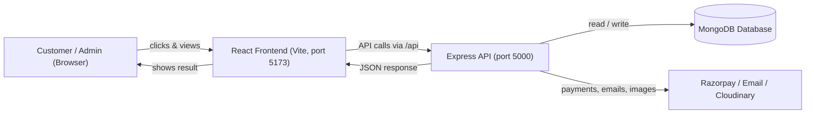
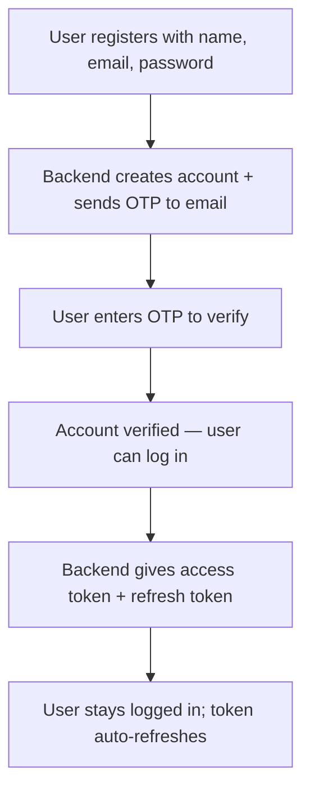
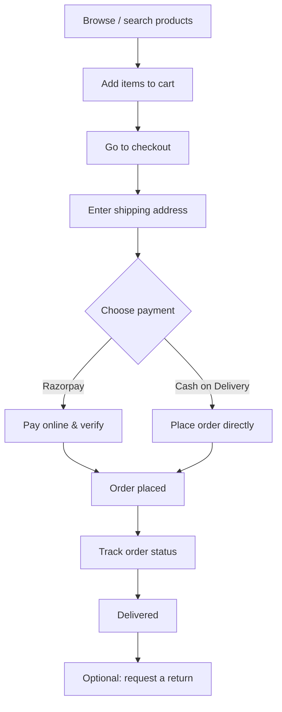
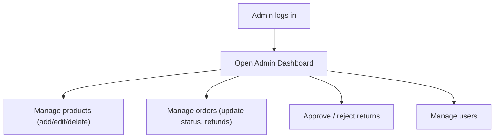
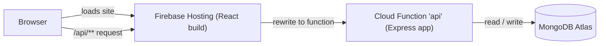

# NexaMart — Electronics E-Commerce Marketplace

NexaMart is a full-featured online store for selling electronics (smartphones, laptops, headphones, smart watches, tablets, gaming devices, and accessories). It is built with the **MERN stack** (MongoDB, Express, React, Node.js) and includes everything a real shop needs: product browsing, cart, checkout, payments, order tracking, returns, and a complete **admin dashboard**.

This README explains the whole project in simple language so anyone — even someone new to coding — can understand what it does and how to run it.

---

## Table of Contents

1. [What can it do?](#what-can-it-do)
2. [Tech stack](#tech-stack)
3. [How the project is organized](#how-the-project-is-organized)
4. [How it all works (the flow)](#how-it-all-works-the-flow)
5. [Getting started](#getting-started)
6. [Demo login accounts](#demo-login-accounts)
7. [Environment variables explained](#environment-variables-explained)
8. [Available commands](#available-commands)
9. [API overview](#api-overview)
10. [Data models](#data-models)
11. [Good to know](#good-to-know)

---

## What can it do?

### For customers (shoppers)
- **Browse products** on a clean homepage with featured items, categories, and best sellers.
- **Search & filter** products by keyword, category, brand, and price range.
- **Product details page** with images, specifications, ratings, and customer reviews.
- **Wishlist** — save products you like for later.
- **Shopping cart** — add items, change quantities, see the total.
- **Checkout** — enter a shipping address, choose a delivery and payment method.
- **Online payments** through Razorpay (test mode), or Cash on Delivery.
- **Track orders** — see order status step by step, download an invoice.
- **Returns** — request a return with photos and a reason.
- **Account** — register with email + OTP verification, login, reset password, edit profile.

### For admins (shop owners)
- **Dashboard** with sales stats and charts.
- **Manage products** — add, edit, delete, upload images, set stock and pricing.
- **Manage orders** — update status, mark payments, add notes, bulk update.
- **Handle returns** — approve or reject return requests and process refunds.
- **Manage users** — change roles, suspend accounts, delete users.
- **Store settings** and **activity logs**.
- **Export** orders and products to CSV.

---

## Tech stack

| Layer | Technology |
|-------|------------|
| **Frontend** | React 18, React Router, Vite, Axios, Recharts (charts) |
| **Backend** | Node.js, Express |
| **Database** | MongoDB (with Mongoose) |
| **Auth** | JWT (access + refresh tokens), bcrypt for passwords |
| **Payments** | Razorpay |
| **Email/OTP** | Nodemailer (SMTP) |
| **Image storage** | Cloudinary (optional) or stored in MongoDB |
| **Security** | Helmet, CORS, rate limiting, mongo-sanitize, Zod validation |

---

## How the project is organized

```
NexaMart/
├── package.json          # Root scripts (run everything together)
├── .env                  # Your secret config (you create this)
├── .env.example          # Template showing what goes in .env
│
├── backend/              # The server (API)
│   ├── server.js         # App entry point — starts the server
│   └── src/
│       ├── config/       # Database, env, Cloudinary, Razorpay setup
│       ├── models/       # Database shapes (User, Product, Order, etc.)
│       ├── controllers/  # The logic for each feature
│       ├── routes/       # The API URLs (endpoints)
│       ├── middleware/   # Auth checks, error handling, file uploads
│       ├── validators/   # Input validation rules
│       └── utils/        # Helpers (email, tokens, seed data, etc.)
│
└── frontend/             # The website (what users see)
    ├── index.html
    └── src/
        ├── main.jsx       # App entry point
        ├── App.jsx        # All the page routes
        ├── pages/         # Each screen (Home, Cart, Checkout, Admin, ...)
        ├── components/    # Reusable pieces (Navbar, Footer, ProductCard, ...)
        ├── context/       # Shared state (Auth, Cart, Toast, Confirm)
        ├── api/           # Axios setup for talking to the backend
        ├── utils/         # Helpers (formatting, etc.)
        └── styles/        # All the CSS
```

**Simple way to think about it:**
- The **frontend** is the shop you see and click on.
- The **backend** is the brain that stores data and makes decisions.
- The **database** is the warehouse where everything (products, users, orders) is kept.

---

## How it all works (the flow)

### Big picture



When you open the website, the **frontend** sends requests (like "give me products") to the **backend** through `/api/...` URLs. The backend talks to the **database**, then sends back the answer, and the frontend shows it on screen.

> During development, Vite forwards any request starting with `/api` to the backend on port 5000, so both run together smoothly.

### Sign up & login flow



- Passwords are **hashed** (scrambled) before saving — never stored as plain text.
- Login uses **JWT tokens**: a short-lived access token and a longer refresh token (stored in a secure cookie).

### Shopping & order flow



### Admin flow



---

## Getting started

### 1. Prerequisites
You need these installed on your computer:
- **Node.js** (v18 or newer) — [download here](https://nodejs.org)
- **A MongoDB database** — easiest is a free [MongoDB Atlas](https://www.mongodb.com/atlas) cluster.

### 2. Install everything
From the project root folder, run:

```bash
npm run install:all
```

This installs packages for the root, backend, and frontend in one go.

### 3. Create your `.env` file
Copy the example file and fill in your own values:

```bash
copy .env.example .env      # Windows
# or
cp .env.example .env        # macOS / Linux
```

At minimum, set your `MONGO_URI` (your MongoDB connection string) and the `JWT_SECRET` values. See [Environment variables explained](#environment-variables-explained) below.

### 4. Add sample data (seeding)
This fills the database with 33 realistic electronics products and demo accounts:

```bash
npm run seed
```

### 5. Start the app
Run the backend and frontend together:

```bash
npm run dev
```

Now open:
- **Website:** http://localhost:5173
- **API health check:** http://localhost:5000/api/health

> Tip: `npm run setup` does steps 2, 4 in one shot (install + seed).

---

## Demo login accounts

After seeding, you can log in with these test accounts:

| Role | Email | Password |
|------|-------|----------|
| **Admin** | `admin@shop.com` | `Admin@123` |
| **Customer** | `user@shop.com` | `User@123` |

The admin account can access the dashboard at **http://localhost:5173/admin**.

---

## Environment variables explained

These go in your `.env` file (in the project root). Here is what each one means:

| Variable | What it's for |
|----------|---------------|
| `PORT` | Port the backend runs on (default `5000`). |
| `NODE_ENV` | `development` or `production`. |
| `CLIENT_URL` | The frontend address (for CORS), e.g. `http://localhost:5173`. |
| `MONGO_URI` | Your MongoDB connection string. **Required.** |
| `JWT_SECRET` | Secret key to sign login tokens. Use a long random string. |
| `JWT_EXPIRES_IN` | How long an access token lasts (e.g. `15m`). |
| `JWT_REFRESH_SECRET` | Secret for refresh tokens. Use a different long random string. |
| `JWT_REFRESH_EXPIRES_IN` | How long a refresh token lasts (e.g. `7d`). |
| `SMTP_*` | Email settings for sending OTP and reset emails. |
| `OTP_EXPIRES_MIN` / `OTP_LENGTH` | How long an OTP is valid and how many digits. |
| `RATE_LIMIT_*` | Limits how many requests a user can make (anti-abuse). |
| `COOKIE_SECURE` | Set `true` in production (HTTPS) for secure cookies. |
| `CLOUDINARY_*` | Optional — for storing uploaded product images in the cloud. |
| `RAZORPAY_*` | Test keys from Razorpay for online payments. |

> If you leave `SMTP_*`, `CLOUDINARY_*`, or `RAZORPAY_*` empty, the core app still works — those just enable email, cloud images, and online payments.

---

## Available commands

Run these from the **project root**:

| Command | What it does |
|---------|--------------|
| `npm run install:all` | Installs all dependencies (root + backend + frontend). |
| `npm run dev` | Starts backend and frontend together. |
| `npm run seed` | Fills the database with demo products and accounts. |
| `npm run setup` | Installs everything and seeds the database. |
| `npm run build` | Builds the frontend for production. |

Backend-only (run inside `backend/`):
- `npm start` — run the server in production mode.
- `npm run dev` — run the server with auto-reload (nodemon).

---

## API overview

All endpoints start with `/api`. Here are the main groups:

| Group | Base URL | Purpose |
|-------|----------|---------|
| Auth | `/api/auth` | Register, verify OTP, login, logout, refresh, profile, password reset. |
| Products | `/api/products` | List, search, filter, product details, admin add/edit/delete. |
| Cart | `/api/cart` | View and update the shopping cart. |
| Wishlist | `/api/wishlist` | Add/remove saved products. |
| Reviews | `/api/reviews` | Read and post product reviews. |
| Orders | `/api/orders` | Place orders, view orders, cancel, request returns. |
| Payment | `/api/payment` | Create and verify Razorpay payments. |
| Admin | `/api/admin` | Stats, orders, returns, users, exports, logs. |
| Settings | `/api/admin/settings` | Store settings. |

**Example auth endpoints:**
```
POST /api/auth/register      # create account (sends OTP)
POST /api/auth/verify-otp    # verify email with OTP
POST /api/auth/login         # log in
POST /api/auth/refresh       # get a new access token
GET  /api/auth/profile       # get logged-in user info
```

---

## Data models

The main "things" stored in the database:

- **User** — name, email, hashed password, role (`user` or `admin`), cart, wishlist, addresses, verification status.
- **Product** — name, brand, category, description, price, MRP, stock, images, specs, rating, reviews, featured flag.
- **Order** — the buyer, list of items, shipping address, totals, status, payment info, tracking events, returns.
- **Review** — a product rating + comment by a user.
- **Settings** — store-wide configuration.
- **Otp** — one-time codes for email verification.
- **ActivityLog** — record of admin actions for auditing.

---

## Deploy to Firebase

**Live site:** https://nexamart-28c93.web.app
**Project ID:** `nexamart-28c93`

### How the deployment is structured



- **Frontend** (React build in `frontend/dist`) is served by **Firebase Hosting**.
- Any request to **`/api/**`** is rewritten to the **`api` Cloud Function**, which runs the full Express backend.
- **Firebase Analytics** is initialized in the React app (`frontend/src/firebase.js`).

### Files that power the deploy
| File | Purpose |
|------|---------|
| `firebase.json` | Hosting config + `/api/**` rewrite to the function. |
| `.firebaserc` | Sets the default project (`nexamart-28c93`). |
| `backend/firebaseApi.js` | Wraps the Express app as a Cloud Function named `api`. |
| `backend/src/createApp.js` | Builds the Express app (shared by local server + function). |
| `scripts/prepare-firebase-env.js` | Copies root `.env` into `backend/.env` for the function (with production values). |
| `frontend/.env.production` | `VITE_API_URL=/api` so the live site calls the function through the rewrite. |

### Prerequisites (one time)
1. Install the Firebase CLI: `npm install -g firebase-tools`
2. Log in: `firebase login`
3. **Cloud Functions require the Blaze (pay-as-you-go) plan.** Upgrade here:
   https://console.firebase.google.com/project/nexamart-28c93/usage/details
   (Blaze still has a generous free tier — small projects usually cost nothing.)

### Firebase commands (cheat sheet)
Run these from the **project root**:

| Command | What it does |
|---------|--------------|
| `firebase login` | Log in to your Firebase account. |
| `firebase projects:list` | List your Firebase projects. |
| `firebase use nexamart-28c93` | Select this project. |
| `npm run deploy` | Deploy **both** hosting + functions (`firebase deploy`). |
| `npm run deploy:hosting` | Deploy **only** the frontend (`firebase deploy --only hosting`). |
| `npm run deploy:functions` | Deploy **only** the backend API (`firebase deploy --only functions`). |
| `firebase deploy --only functions:api` | Deploy just the `api` function. |
| `firebase functions:log` | View live logs from the deployed API. |
| `firebase hosting:channel:deploy preview` | Deploy a temporary preview URL. |
| `firebase open hosting:site` | Open the live site in a browser. |

### Full deploy (after Blaze upgrade)
```bash
# from the project root
firebase use nexamart-28c93
npm run deploy
```
This will:
1. Run `scripts/prepare-firebase-env.js` (prepares `backend/.env`).
2. Install backend dependencies.
3. Build the React frontend.
4. Deploy the `api` Cloud Function and the Hosting site.

After it finishes, the live site at https://nexamart-28c93.web.app will show real products, login, cart, etc.

> Note: the seeded demo data lives in your MongoDB Atlas database. Make sure your `.env` `MONGO_URI` points to it and you have run `npm run seed` at least once.

### Alternative — host the backend on Render (free, no Blaze)
If you prefer not to upgrade to Blaze, host the API on a free service:
1. Push this repo to GitHub.
2. Create a new **Web Service** on [Render](https://render.com) — it auto-detects `render.yaml`.
3. Add your secrets in the Render dashboard (`MONGO_URI`, `JWT_SECRET`, `JWT_REFRESH_SECRET`, etc.).
4. Set `CLIENT_URL=https://nexamart-28c93.web.app`.
5. Update `frontend/.env.production` with your Render URL:
   ```
   VITE_API_URL=https://YOUR-RENDER-URL.onrender.com/api
   ```
6. Remove the `/api/**` function rewrite from `firebase.json` (keep only the `**` → `/index.html` rewrite), then redeploy hosting:
   ```bash
   npm run deploy:hosting
   ```

---

## Good to know

- **Security built in:** passwords are hashed, requests are rate-limited, inputs are validated (Zod), and common attacks are blocked (Helmet, mongo-sanitize).
- **Images:** seeded products use online image URLs; admin uploads can use Cloudinary (if configured) or be stored in MongoDB. If an image fails to load, a branded placeholder is shown.
- **Tokens auto-refresh:** users stay logged in smoothly without re-entering passwords often.
- **Responsive design:** the site works on mobile, tablet, and desktop.

---

Built with the MERN stack. Happy shopping!
